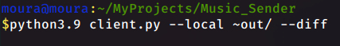

============
Music Sender
============

A little app that sends music dinamically or update a music catalogue to
another device automatically. There's two ways to use this program, You can 
use the command line version or gui version or both at the same time (i.e in 
different modes). See `Terminal`_ to know how to use the terminal version, or
the `User interface app`_

Command line arguments
======================

Server
------

    -h, --help
        Show this help message and exit.

    -l LOCAL, --local LOCAL
        Indicates where the script have to find musics.

Client
------

    -h, --help
        show this help message and exit.

    -v, --available
        shows the available music catalog and theirs code numbers
        (e.g 120, 0, 31).

    -c COPY, --copy COPY
        download a music from a given option, should make nothing if the 
        option is invalid.

    -d, --diff
        This shows a list of musics that in server but not in client music
        directory (sorry, I like math). This option is very useful when you
        want make a single copy of a music you don't have.

    -a, --automatic
        Downloads the list of musics that is not in client directory.

    -l LOCAL, --local LOCAL
        This is the path the musics will be download, default is ./.

How to use
==========

Terminal
--------

Server
~~~~~~

Given the options in `Command line arguments`_, start your server.
Here an example of what you can do.

    .. image:: images/server_commandline_sample.png

In the command above, you just asking to the server script to get musics from
the "~/Musics" or "/home/user/Musics" directory. When you click enter you 
should see this output.

    .. image:: images/working_server.png
        
Great, that means that our server is running and he's ready to send musics to 
any client.

.. note:: You don't need to start a server in a only-music directory, the 
          server script will automatically filter the musics and send the 
          correct indexes to the client. You can initialize the server in a 
          empty directory too, but this is not useful (since you want to send 
          musics instead of nothing).

Client
~~~~~~
Since the server is working, you can turn on the client script in another 
device and make some requests.

With the client script, you can request a simple file, request an list of the 
available music on the server or the list of musics that are missing in the 
client directory and make an automatic download (i.e request the musics that 
aren't in the client directory).
See an example...

    .. image:: images/client_available_command.png

This command above asks to the server the available musics on it. When you 
click enter you should see this output.

    .. image:: images/client_available_output.png

Similarly, there's a "diff" option (i.e It shows the missing musics in the 
client directory).

    .. image:: images/client_diff_output.png

.. note:: Remember that the diff option compare the client directory (i.e the 
          choosen directory where the musics will be downloaded), so it's 
          recommended to use the "--local" option.

After that, you can request a music by his code, with the "copy" option:

    .. image:: images/client_copy_output.png

You can request an automatic action too that will download all the missing 
musics (the previous note about "diff" option applies to the "automatic" 
option since he use the "diff" option to download only the necessary files).

    .. image:: images/client_automatic_output.png

In case the server doesn't contain any music file, for any command the output 
will look like this (except "copy" option).

    .. image:: images/client_not_music.png

Or in the case the client cannot connect to the server, that is the following 
output.

    .. image:: images/client_error.png

User interface app
------------------

The user interface app is the most easy to use, since he gives only two 
options, start a server or download the musics.

Meeting the interface
~~~~~~~~~~~~~~~~~~~~~

Here is your interface of music sender.

    .. image:: images/interface.png

Mode
   This is a mode selector, that dinamically changes the behavior of the 
   application. For instance, if you click the server mode, the button 
   behavior is changed to starting a music sender server.

Path
   In this case it relies on your mode. If you set server mode, the path 
   indicates where the music sender need to find the musics. If you set 
   client mode, the path indicates the path where the musics will be 
   downloaded.

Status
   This show if there's any issue about the program, such as "ERROR" or "OK".
   Usually indicates "ERROR" for path entry (i.e If the path is invalid) or a 
   application problem (e.g was not possible to connect to the server or 
   start one.).

Button
   When you're ready to start the application, you can just click the 
   button and he will make all the magic.

Starting a server
~~~~~~~~~~~~~~~~~

To start a server just select the server mode and press the start button.

    .. image:: images/interface_server_running.png

Requesting the musics
~~~~~~~~~~~~~~~~~~~~~

To request the musics just select the client mode and press the update button.

    .. image:: images/interface_client_running.png
